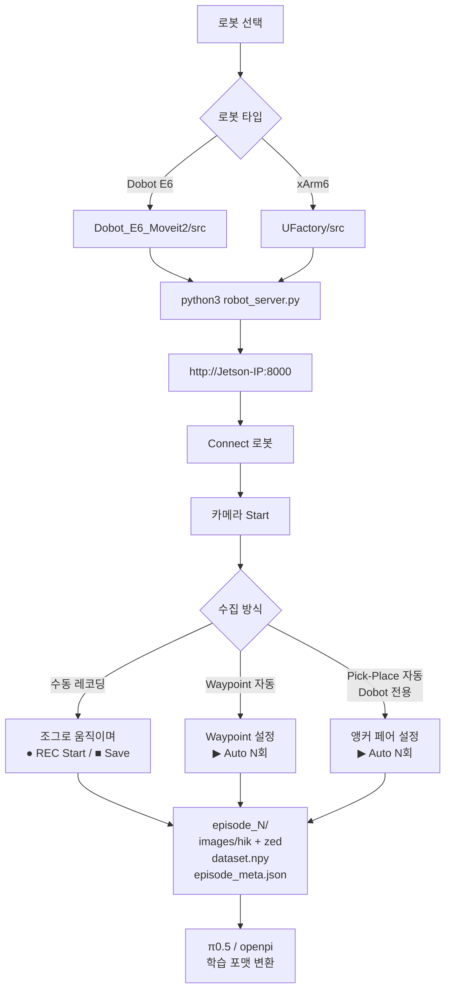

# dobot-xarm-datacollect

Dobot E6 및 UFactory xArm6 두 가지 로봇 암을 지원하는 **VLA(Vision-Language-Action) 학습용 데이터 수집 시스템**.  
FastAPI 웹 서버 + ROS2 Humble 동기화 레코더로 로봇 상태와 카메라 프레임을 정밀 정합하여 저장합니다.

---

## 지원 로봇

| 로봇 | 디렉토리 | 통신 | 상태 |
|------|----------|------|------|
| **Dobot E6** | `Dobot_E6_Moveit2/` | TCP/IP `192.168.5.1` | ✅ 안정 운용 중 |
| **UFactory xArm6** | `UFactory/` | TCP/IP `192.168.1.225` | ✅ 운용 중 |

---

## 디렉토리 구조

```
dobot-xarm-datacollect/
├── Dobot_E6_Moveit2/          # Dobot E6 전용
│   ├── src/
│   │   ├── robot_server.py        # FastAPI 서버 (port 8000)
│   │   ├── dobot_e6_controller.py # TCP/IP 제어
│   │   ├── pick_place_gui_new.py  # Pick-Place GUI + 레코더
│   │   ├── pick_place_gui_random_pose.py
│   │   ├── suction_gripper.py     # 흡착 그리퍼
│   │   ├── camera_viewer.py       # HIKRobot 카메라
│   │   └── ros2_recorder.py       # ROS2 동기화 레코더
│   ├── urdf/                  # Dobot ME6 URDF
│   └── config/                # MoveIt2 설정
│
├── UFactory/                  # UFactory xArm6 전용
│   └── src/
│       ├── robot_server.py        # FastAPI 서버 (port 8000)
│       ├── xarm_controller.py     # xArm SDK 제어 + 안전설정
│       ├── xarm_gripper.py        # xArm Gripper G2
│       ├── waypoint_collector.py  # Waypoint 기반 자동 수집
│       ├── pick_place_gui_new.py  # Pick-Place GUI
│       ├── camera_viewer.py       # HIKRobot 카메라
│       └── ros2_recorder.py       # ROS2 동기화 레코더
│
├── MvImport/                  # HIKRobot SDK (공용)
├── dobot_api.py               # Dobot raw TCP/IP API
├── camera_calibration_hikrobot.py
├── hikrobot_calibration_*.npz # HIK 카메라 캘리브레이션
└── check_camera.py
```

---

## 시스템 구성

| 구성 요소 | 사양 |
|-----------|------|
| 컴퓨터 | NVIDIA Jetson (Ubuntu 22.04 aarch64) |
| 손목 카메라 | HIKRobot (USB) |
| 씬 카메라 | ZED 2i (USB3, LEFT view 224×224) |
| 서버 포트 | FastAPI port 8000 |
| 동기화 | ROS2 Humble — ApproximateTimeSynchronizer |

---

## 데이터 수집 플로우



---

## 빠른 시작

### Dobot E6

```bash
cd ~/dobot-xarm-datacollect/Dobot_E6_Moveit2/src
python3 robot_server.py
# → http://<Jetson-IP>:8000
```

### UFactory xArm6

```bash
# 네트워크 설정 (최초 1회)
sudo nmcli connection modify robot_net +ipv4.addresses 192.168.1.100/24
sudo nmcli connection up robot_net

cd ~/dobot-xarm-datacollect/UFactory/src
python3 robot_server.py
# → http://<Jetson-IP>:8000
```

---

## 저장 데이터 포맷

```python
# dataset.npy 한 프레임
{
    'frame_id':        int,
    'timestamp':       float,
    'image_path_hik':  'hik/frame_000000.jpg',   # 224×224
    'image_path_zed':  'zed/frame_000000.jpg',   # 224×224
    'joint_angles':    [j1, j2, j3, j4, j5, j6], # degrees
    'tcp_pose':        [x, y, z, rx, ry, rz],    # mm / deg
    'gripper_tooldo1': 0 or 1,
    'robot_mode':      int,
}
```

---

## 의존성

```bash
pip install xarm-python-sdk fastapi uvicorn opencv-python numpy
# ROS2 Humble (Ubuntu 22.04)
sudo apt install ros-humble-ros-base ros-humble-cv-bridge python3-rclpy
```

---

## 안전 설정 (xArm6)

연결 시 자동 적용:

```
TCP Boundary : X 100~750mm / Y -550~550mm / Z -100~650mm
Joint Limits : J2[-118~120°] J3[-225~11°] J5[-97~180°]
Max TCP Speed: 300 mm/s
Collision Rebound: ON
```
