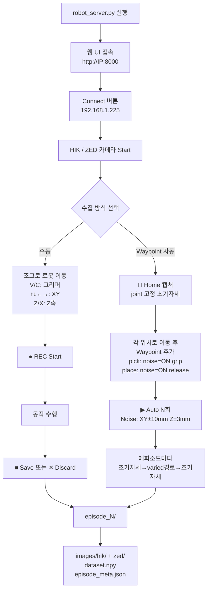

# UFactory xArm6 데이터 수집

π0.5 / openpi 학습용 데이터 수집 서버 — xArm6 + HIKRobot + ZED.

---

## 실행

```bash
cd ~/dobot-xarm-datacollect/UFactory/src
python3 robot_server.py
# → http://<Jetson-IP>:8000
```

---

## 파일 구조

| 파일 | 역할 |
|------|------|
| `robot_server.py` | FastAPI 웹 서버, 레코딩, 카메라 |
| `xarm_controller.py` | xArm SDK 래퍼, 안전 설정, jog |
| `xarm_gripper.py` | Gripper G2 위치 제어 (0~85mm) |
| `waypoint_collector.py` | Waypoint 기반 자동 에피소드 수집 |
| `ros2_recorder.py` | ROS2 `/xarm/` 토픽 퍼블리시 |
| `camera_viewer.py` | HIKRobot USB 카메라 |

---

## 데이터 수집 플로우



---

## 키보드 단축키

| 키 | 동작 |
|----|------|
| `↑↓←→` | TCP X+/X-/Y+/Y- |
| `Z` / `X` | TCP Z+ / Z- |
| `V` 꾹 | 그리퍼 천천히 닫기 |
| `C` 꾹 | 그리퍼 천천히 열기 |
| `Q` | 그리퍼 완전 닫기 |
| `W` | 그리퍼 완전 열기 |
| `J1+` ~ `J6-` | 관절 개별 jog (UI 버튼) |

---

## 안전 설정

연결 시 `xarm_controller.py._apply_safety_config()` 자동 실행:

```
TCP Boundary:  X 100~750 / Y -550~550 / Z -100~650 mm
Joint Limits:  J2[-118~120°] J3[-225~11°] J5[-97~180°]  (xarm_ros2 xacro 기준)
TCP Speed:     ≤ 300 mm/s
Joint Speed:   ≤ 100 deg/s
Rebound:       충돌 감지 시 자동 복귀
```

---

## 학습 데이터 포맷 (π0.5 / openpi)

```
observation:
  image_front  (ZED LEFT 224×224)
  image_wrist  (HIK 224×224)
  joint_state  [j1~j6, deg]
  tcp_pose     [x,y,z,rx,ry,rz  mm/deg]
  gripper_pos  [0~85 mm]

action:
  joint_delta  [Δj1~Δj6]  ← 다음 프레임 기준 계산
  gripper_cmd  [0~85 mm]

extra:
  language_instruction
  timestamp
```

---

## 네트워크 설정

```bash
# 최초 1회 (영구 적용)
sudo nmcli connection modify robot_net +ipv4.addresses 192.168.1.100/24
sudo nmcli connection up robot_net
```

xArm IP: `192.168.1.225`  
SDK 포트: `30000~30003` (자동)
